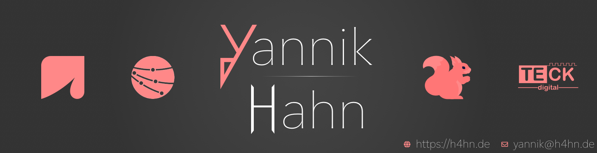

<h1>Hi!
    
</h1>

My name is Yannik. I am a self-taught full stack developer from Germany. I am studying IBAIT 
(Internation Business Administration and Information Technology) at SAP Germany. Apart from that I work on [@TECKdigital](https://github.com/Teck-Digital), which is a school company I co-founded. If you want to learn more about me, 
you can check out my website at https://h4hn.de!

## Github Stats

A quick note on my profile - most of my project's repositories are and have to unfortunately remain private because
they contain sensible information. If you want to know what I am currently working on, you should check out my website. 

I am, however, looking forward towards creating more open source code in the near future!

## Languages and Tools

Here are the programming languages I feel comfortable at and tools I like to use while working:

### Languages
<code></code>
<code></code>
<code></code>
<code></code>
<code></code>
<code></code>
<code></code>

### Tools & Frameworks
<code></code>
<code></code>
<code></code>
<code></code>
<code></code>
<code></code>
<code></code>
<code></code>
