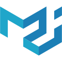

<h1>Hi!
    
</h1>

My name is Yannik. I am a full-stack developer from Germany. I am studying IBAIT 
(Internation Business Administration and Information Technology) at SAP Germany. In my free time, I work on [@TECKdigital](https://github.com/Teck-Digital), which is a hobby company that emerged during my school time. Occasionally I do more random stuff like hosting a Minecraft role-play project ([@mc-nations](https://github.com/mc-nations)). If you want to learn more about me or my projects, 
you can check out my website at https://h4hn.de!

## Languages and Tools

Here are the programming languages I feel comfortable with and tools I like to use while working:

### Languages
<code></code>
<code></code>
<code></code>
<code></code>
<code></code>
<code></code>
<code></code>
<code></code>

### Tools & Frameworks

<code></code>
<code></code>
<code></code>
<code></code>
<code></code>
<code></code>
<code></code>
<code></code>
<code></code>
<code></code>

### Misc

<code></code>
<code></code>
<code></code>
<code></code>
<code></code>
<code></code>
          

          
